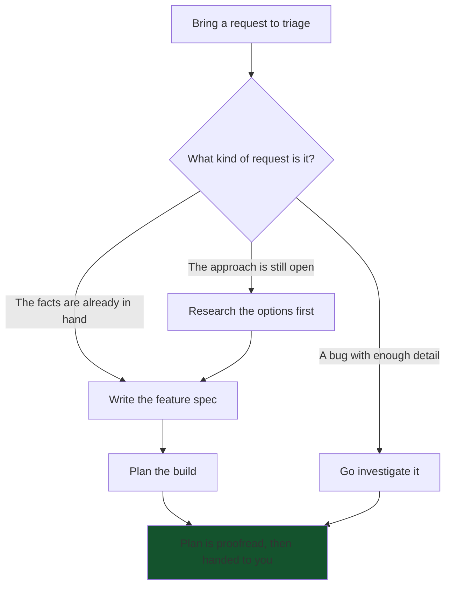
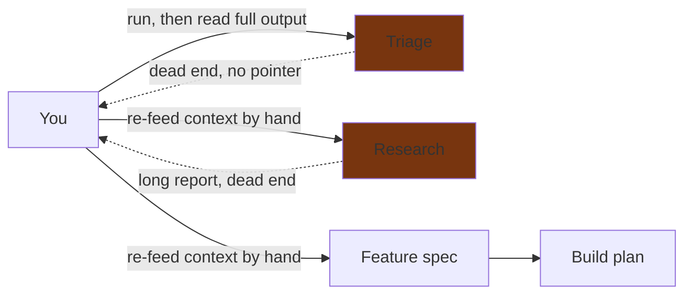

# Sharpening Han's Planning Workflow (Issue #36 Fixes) — Stakeholder Summary

## What problem are we solving?

Someone used Han's full planning chain end-to-end in one sitting — triage an incoming request, research the options, write the feature spec, then plan the build. The analysis came back thorough and trustworthy; that part worked. But the experience had rough edges. The output was far longer than a quick decision needed. Each step dropped the person at a dead end with no pointer to the next one, so they had to already know the chain and carry the context forward by hand. The triage step treated a "help me scope this" request like a bug ticket and attached fields that meant nothing for it. And the final build plan came out with a copy-pasted heading and long stretches of configuration text that a builder does not need to read during the build.

None of this was wrong, exactly. It was friction: the workflow is tuned for a high-stakes decision and felt like overkill for a fifteen-minute one, and it leaned on the person to be the glue between steps. These changes right-size the output, connect the steps, and let each step recognize the kind of request it is handling.

- **Output that matches the decision** — a quick call gets a short read; a heavy call still gets the full depth.
- **Each step points you to the next** — triage tells you whether to research first or go straight to speccing, and research tells you when you are ready to spec.
- **Triage that tells a scoping request from a bug** — it stops attaching severity and reproduction fields to requests where they do not apply.
- **Build plans that check themselves** — the finished plan is proofread for mismatched headings and broken references before you ever see it.
- **Steps that look before they ask** — when you have connected a source that already holds the answer, the step checks it instead of stopping to ask you.

## What does this open up?

- **Faster decisions** — a short scoping conversation no longer reads like a research dissertation, so people act on it sooner.
- **More trust in the output** — fewer copy-paste slips and broken references in the documents people hand to builders.
- **Fewer manual steps** — you stop being the courier carrying context from one step to the next.
- **The right tool at the right moment** — scoping questions get routed to research instead of being forced down a bug or feature-ticket path that does not fit.
- **Less interruption** — steps quietly resolve factual questions from sources you have already connected rather than stopping to ask.

## What will the user experience look like?

You bring a request to triage. Instead of leaving you to guess what to run next, triage now reads what kind of request it is and what is still unknown, then points you to the next step. If the request is well-understood, you move straight ahead; if the approach itself is still open, triage sends you to research first. Every step along the way produces output sized to the weight of the decision rather than a fixed full-length document.

## How does the data flow today vs. after this change?

These diagrams show how the context for a decision moves between the steps and the person using them.

**Today** — each step ends on its own, and the person carries the context to the next step and decides the whole chain by hand:

After the change, triage reads what is still unknown and sends the person down one of two paths. The path that applies depends on what kind of information is missing when you triage.

**After this change — the approach is still open** (triage sends you to research first, then on to speccing):

This path applies when what is missing at triage time is the *direction itself* — which approach to take, what the options are, whether to build or buy. Triage recognizes that the open question is about the approach and routes you to research before anything gets specced. Research returns a report sized to the decision and, instead of stopping cold, names speccing as the natural next step. The distinguishing outcome here is that a research step happens first, so you commit to a direction on evidence rather than guessing.

**After this change — the facts are already in hand** (triage sends you straight to speccing, skipping research):

This path applies when the request already carries the facts a spec needs — the use case and the success criteria are known, and only the specification is missing. Triage sees there is no open question about the approach, so it skips research entirely and points you straight at speccing. The distinguishing outcome is the opposite of the first path: no research step, because there is nothing left to research. The same self-checking build plan lands at the end of both paths; the only difference is whether a research step sat in the middle.

## What is intentionally not in this slice?

- **A separate "short report" mode** — we are tightening the one report so it scales to the decision, not adding a second format you would have to choose between.
- **A new "discovery" request category in triage** — the categories that already exist, plus the new routing, cover scoping requests; there is no new type to learn.
- **A formal handoff file passed between steps** — the reports each step already produces serve as the handoff; we are only adding the pointer to what comes next.
- **Changing the plain-language rule for feature specs** — specs stay free of implementation terms on purpose; that abstraction is deliberate, and we are not loosening it on the strength of a single round of feedback.
- **A Han-managed feedback file** — where you record your own feedback about Han is your setup, not something a step should create for you.

If any of these cuts would block how your team works, flag it before we start.

## What we are asking stakeholders

- **Brevity vs. a complete paper trail.** Routine decisions would drop to a one-line note, with a "when in doubt, keep the full write-up" backstop — are we comfortable trading some always-complete rationale for shorter, more readable logs?
- **Ship on one round of feedback, or wait for a second.** Every friction here comes from a single person's single session; do we act now and watch for it to recur, or hold until someone else hits the same pain?
- **A benefit only some setups get.** The "look before you ask" behavior only helps when you have connected a source the step can read; otherwise the step still asks you as it does today — is shipping a partial benefit the right call, or should it wait until it works for everyone?
- **Is the triage fork right?** We are routing "the approach is still open" to research and "facts in hand" straight to speccing — is that the correct split, or should triage always leave the choice to you?
